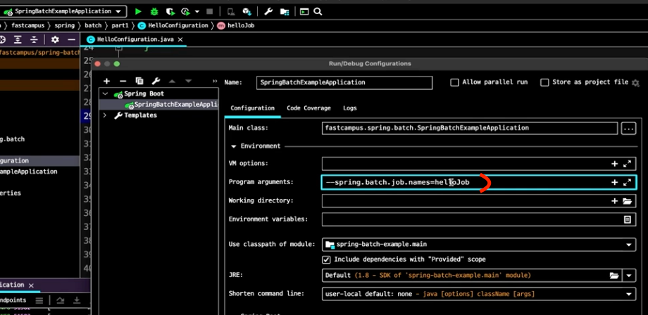
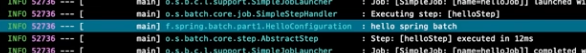
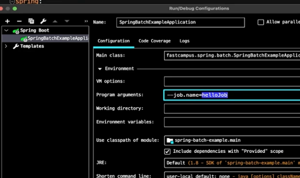
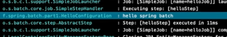

### SpringBatch 란 ? 
- 큰 단위의 작업을 일괄 처리
- 대부분 처리량이 많고 비 실시간성 처리에 사용
  - 대용량 데이터 계산, 정산, 통계, 데이터베이스, 변환 등
- 컴퓨터 자원을 최대로 활용
  - 컴퓨터 자원 사용이 낮은 시간대에 배치를 처리하거나
  - 배치만 처리하기 위해 사용자가 사용하지 않는 또 다른 컴퓨터 자원을 사용
- 사용자 상호작용으로 실행되기 보단, 스케줄러와 같은 시스템에 의해 실행되는 대상
  - 예를 들면 매일 오전 10시에 배치 실행, 매주 월요일 12시 마다 실행
  - crontab, jenkins
- 배치 처리를 하기 위한 Spring Framework 기반 기술
  - Spring 에서 지원하는 기술 적용 가능
  - DI, AOP, 서비스 추상화
- 스프링 배치의 실행 단위인 Job, Step
- 비교적 간단한 작업(Tasklet) 단위 처리와, 대량 묶음(chunk) 단위 처리

### Job
- 배치 처리의 실행 단위
  - spring 에서 job 을 만들수 있게 JobBuilderFactory 라는 class 를 제공한다.
    - 이미 Bean 으로 설정이 되어있기 때문에 바로 생성자 주입을 받을 수 있다.
### Step
- Job 의 실행 단위 이다.
- 하나의 Job 은 한개 이상의 Step 을 가질 수 있다.
  - Step 도 Job 처럼 마찬가지로 JobBuilderFactory 가 Bean 으로 등록되어 있어 생성자 주입이 가능하다. 

### 코드로 맛을 봐보자.
```java
@Configuration
@Slf4j
public class HelloConfiguration {
    
    private final JobBuilderFactory jobBuilderFactory;
    private final StepBuilderFactory stepBuilderFactory;
    
    public HelloConfiguration(JobBuilderFactory jobBuilderFactory, StepBuilderFactory stepBuilderFactory) {
        this.jobBuilderFactory = jobBuilderFactory;
        this.stepBuilderFactory = stepBuilderFactory;
    }
    
    @Bean
    public Job helloJob() {

        /**
         * RunIdIncrementer 는 항상 Job 이 실행될때마다
         * 파라미터 Id 를 자동으로 생성해주는 클래스 이다.
         * start 는 Job 실행시 최초로 실행되는 메서드 이다.
         */
        return jobBuilderFactory.get("helloJob")
                .incrementer(new RunIdIncrementer())
                .start(this.helloStep())
                .build();
    }

    /**
     * Step 은 Job 의 실행 단위 이다.
     * 하나의 Job 은 한개 이상의 Step 을 가질 수 있다.
     * @return
     */
    @Bean
    public Step helloStep() {
        return stepBuilderFactory.get("helloStep")
                .tasklet((contribution, chunkContext) -> {
                    log.info("hello spring batch");
                    return RepeatStatus.FINISHED;
                }).build();
    }
}

```

### 주의 할 점
- helloJob 이 있는데, 다른 job 이 있다고 가정하자.
- 모든 job 이 실행될 것이다.
- 따라서 job 을 실행할때는 job 이름을 명시해줘야 한다.
- 예를 들면 java -jar hello-spring-batch.jar --job.name=helloJob



hello spring batch 가 출력된다.


이를 매번 등록해주면, 귀찮다. ㅋㅋㅋ
따라서 yml 파일에 jobname 을 커스텀 하게 잡아줘 보자.

```yml
spring:
    batch:
        job:
        names: ${job.name:NONE} # job.name 이 없으면 NONE 을 실행하라.
    ```
```

### intellij 에서도 설정해주자



다시 실행해주면 출력이 잘 된것을 확인 할 수 있다.



### 정리
- Job 은 spring batch 의 실행 단위이다.
- step 은 Job 의 실행 단위이다.

### 향로 님의 블로그
[블로그] https://jojoldu.tistory.com/324?category=902551