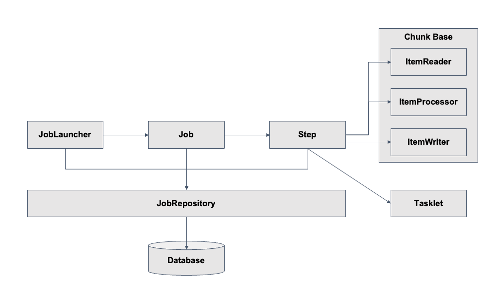

### spring Batch 의 구조에 대해서 알아보자.
- 중요한 객체 관계도

### 스프링 배치는...
- Job Type 의 Bean 이 생성이 되면, JobLauncher 객체에 의해서 job 을 수행한다.
- JobLauncher 가 Job 을 실행하면, Job 은 Step 을 실행한다.
- JobRepository (class) 는 DB 또는 메모리에 스프링 Batch 가 실행할수 있도록 Batch 의 메타 데이터를 관리하는 클래스 이다.
- metaData 는 스프링 배치에 전반적인 데이터를 관리하는 클래스 라고 이해하고 넘어가자.

### 01 번 springBatch 에서 Job 은 배치의 실행 단위라고 하였는데 
- Job 은 JobLauncher 에 의해서 실행이 된다.
- Job 은 N 개 의 Step 을 실행할 수 있으며, 흐름(Flow)을 관리 할 수 있다.
  - 예를 들면, A Step 실행 후 조건에 따라 B Step 또는 C Step 을 실행 설정. 

### Tasklet 과 chunk 기반은 뭘까 ? 
- 극단적인 예를 들면, 10000 개의 데이터를 한번에 처리할때 컴퓨터의 자원이 충분하다. -> Tasklet 기반
- 10000 개의 데이터를 1000 개씩 나눠서 10 번 반복해서 페이징 처리 하겠다. -> Chunk 기반
  - 아 물론. Tasklet 도 10 번 나누어 페이징 처리 할 수 있지만, Chunk 가 이런 경우에 좀더 활용성이 높고 + 명확히 책임을 나누어서 실행가능 하기 때문에... 부적절하다.

- Step 은 Job 의 세부 실행 단위이며, N개가 등록돼 실행된다.
- Step 의 실행 단위는 크게 2가지로 나눌 수 있다.
    1.Chunk 기반 : 하나의 큰 덩어리를 n개씩 나눠서 실행
    2.Task 기반 : 하나의 작업 기반으로 실행
- Chunk 기반 Step 은 ItemReader, ItemProcessor, ItemWriter 라는 클래스로 배치 데이터를 처리 할 수 있다.
    - 여기서 Item 은 배치 처리 대상 객체를 의미한다.
- ItemReader 는 배치 처리 대상 객체를 읽어 ItemProcessor 또는 ItemWriter에게 전달한다.
    - 예를 들면, 파일 또는 DB에서 데이터를 읽는다.
- ItemProcessor는 input 객체를 output 객체로 filtering 또는 processing 해 ItemWriter에게 전달한다.
    - 예를 들면, ItemReader에서 읽은 데이터를 수정 또는 ItemWriter 대상인지 filtering 한다.
- ItemProcessor는 optional 하다.
- ItemProcessor가 하는 일을 ItemReader 또는 ItemWriter가 대신할 수 있다.
    - ItemWriter는 배치 처리 대상 객체를 처리한다.
- 예를 들면, DB update를 하거나, 처리 대상 사용자에게 알림을 보낸다.
