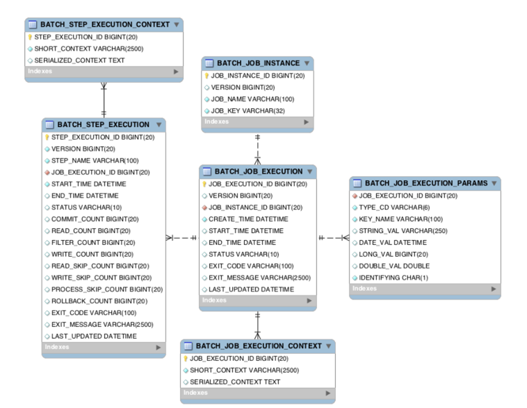

### 아래 그림을 보자.
- springBatch 문서에서 가져온 테이블 구조
- 테이블 명에 Job 이 붙어 있는 테이블 들은 Job 과 관련된 메타 테이블 이고
- 테이블 명에 Step 이 붙어 있는 테이블 들은 Step 과 관련된 메타 테이블 이다.

### 배치 실행을 위한 메타 데이터가 저장되는 테이블
- BATCH_JOB_INSTANCE  
  - Job 이 실행되며 생성되는 최상위 계층의 테이블
  - *row 가 생성되는 기준*: job_name 과 job_key 를 기준으로 하나의 row 가 생성되며, 같은 job_name 과 job_key 가 저장될 수 없다.
  - job_key 는 BATCH_JOB_EXECUTION_PARAMS 에 저장되는 Parameter 를 나열해 암호화해 저장한다.

- *BATCH_JOB_EXECUTION*
  - Job 이 실행되는 동안 시작/종료 시간, job 상태 등을 관리

- *BATCH_JOB_EXECUTION_PARAMS*
  - Job 을 실행하기 위해 주입된 parameter 정보 저장

- *BATCH_JOB_EXECUTION_CONTEXT*
  - Job 이 실행되며 공유해야할 데이터를 직렬화해 저장

- *BATCH_STEP_EXECUTION*
  - Step 이 실행되는 동안 필요한 데이터 또는 실행된 결과 저장

- *BATCH_STEP_EXECUTION_CONTEXT*
  - Step 이 실행되며 공유해야할 데이터를 직렬화해 저장
